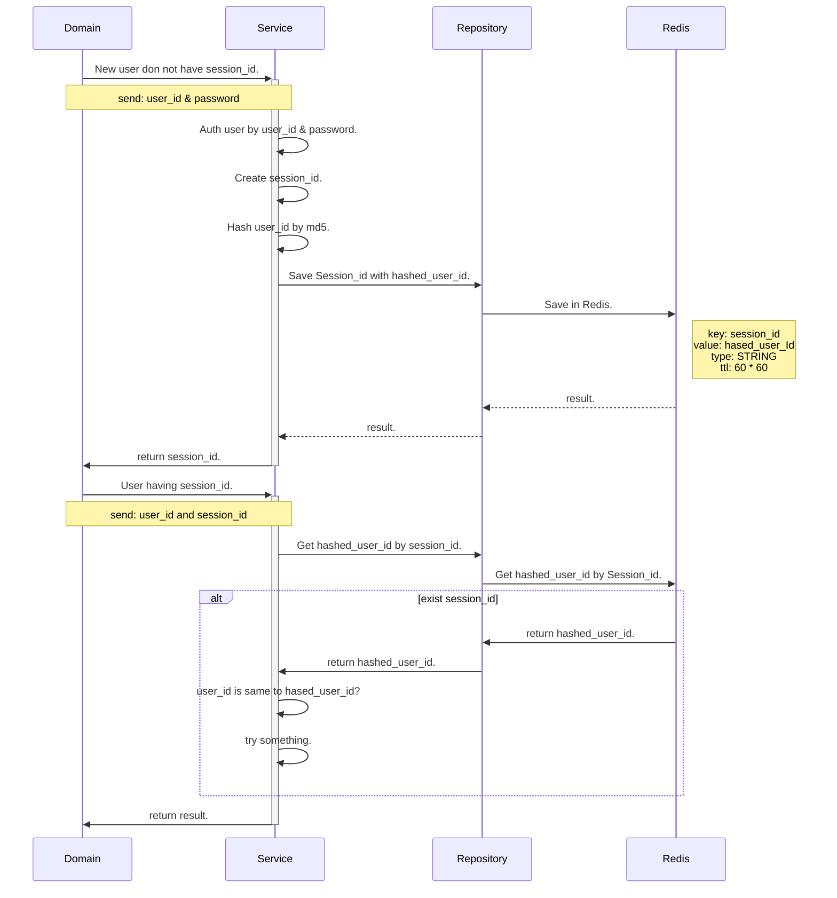
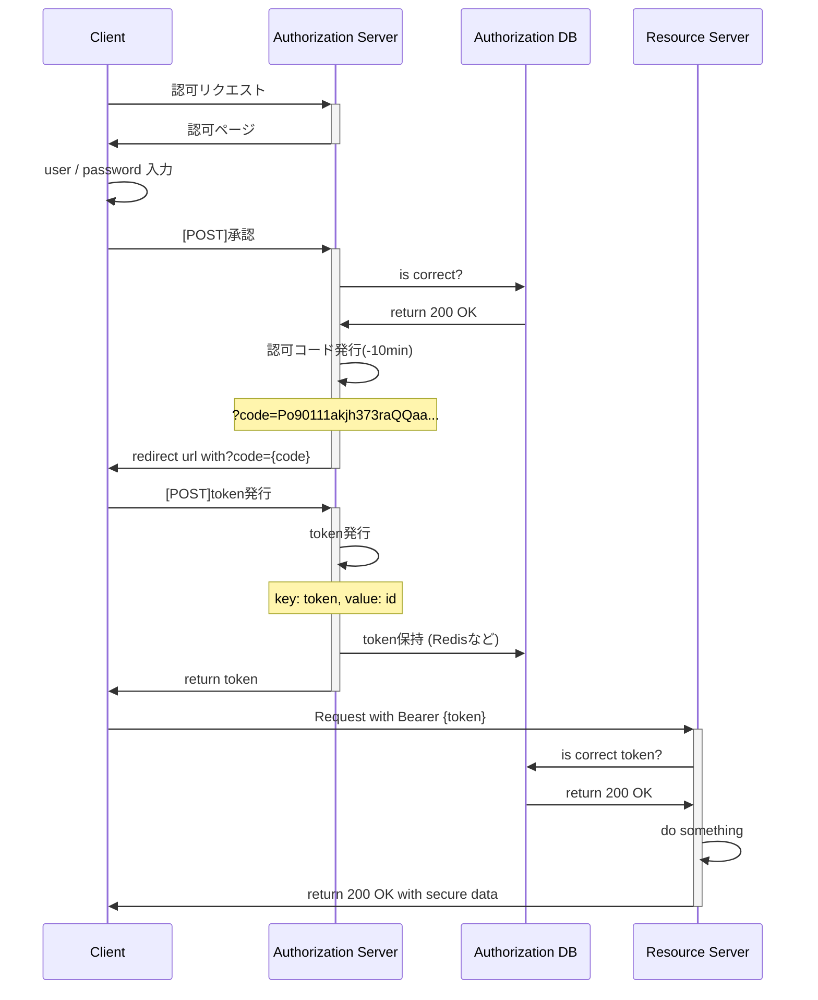

# フレームワークを使わずに色々理解したい

## 目的

- フレームワークを使っていると、内部実装に対する理解が浅くなる
- なので、原理原則を知るために、フレームワークではなくライブラリーのみを使用して挙動を理解したい
- 理解したい項目は下記
  - Redis
  - RFC6750
  - autoload
  - middleware

## Redis


 - Redisを使ってログインSessionを管理する簡易実装

```
// env生成
cp .example.env .env

// Redisを起動
redis-server
redis-cli // 操作したい時（ポート確認）

// Redisにデータを出し入れする
php App/Domain/UnderstandRedisDomain.php
```

### SequenceDiagram with Redis



## RFC6750　
 - OAuth2.0におけるtokenによる認証認可
 - Bearerスキームの定義
    - 仕様書
       - https://datatracker.ietf.org/doc/html/rfc6750
    - 仕様
       - tokenは任意のtoken68文字列
       - Authorization Header: Bearer Token は1つのみ含める
       - TLSの常時使用
       - tokenのTTLは60min以内
       - authorization codeのTTLは10min以内
       - tokenをURLに含めない
 - 実装は大変なので、Authleteなどの外部APIを活用する

| | | |
| -- | -- | -- |
| OAuth2.0 | RFC6749 |  |
| BearerTokenUsage | RFC6750 |認可サーバーが発行したtokenをリソースサーバに送るAPI仕様|
| OAuth1.0 | RFC5849 | OAuth2.0により廃止 |
| OpenIDConnect |  |  |
| JsonWebToken | RFC7519 |  |


```php
// 401 Unauthorized (Authorization Header is undefined)
WWW-Authenticate: Bearer realm="{string}"

// 401 Unauthorized (Token is invalid)
WWW-Authenticate: Bearer error="invalid_token"

// 400 Unauthorized (Invalid Request param)
WWW-Authenticate: Bearer error="invalid_request"

// 403 BadRequest (Request Param is invalid scope)
WWW-Authenticate: Bearer error="insufficient_scope"

```


