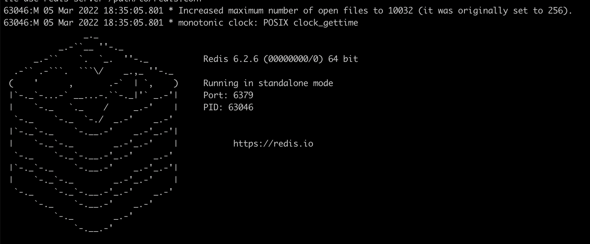
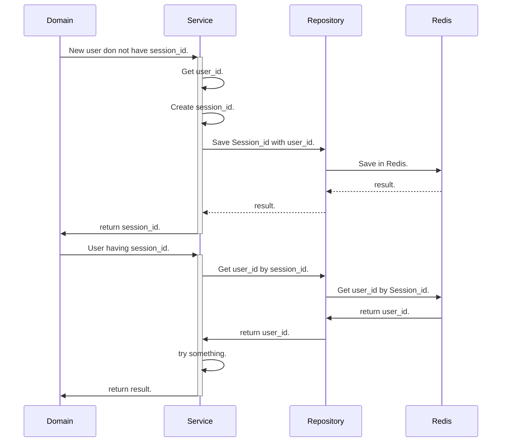

# フレームワークを使わずに色々理解したい

## 目的

- フレームワークを使っていると、内部実装に対する理解が浅くなる
- なので、原理原則を知るために、フレームワークではなくライブラリーのみを使用して挙動を理解したい
- 理解したい項目は下記
  - Redis
  - RFC6750
  - autoload
  - middleware

## Redis



 - Redisを使ってログインSessionを管理する簡易実装

```
// env生成
cp .example.env .env

// Redisを起動
redis-server
redis-cli // 操作したい時（ポート確認）

// Redisにデータを出し入れする
php App/Domain/UnderstandRedisDomain.php
```

### SequenceDiagram with Redis



## Autoload

- 前提
  - require を使いたくない
- 設定
  - composer install
  - composer dump-autoload // create autoload.php

```composer.json
{
    "autoload": {
        "psr-4": {
            "App\\": "src/"
        }
    }
}
```

## interephence
