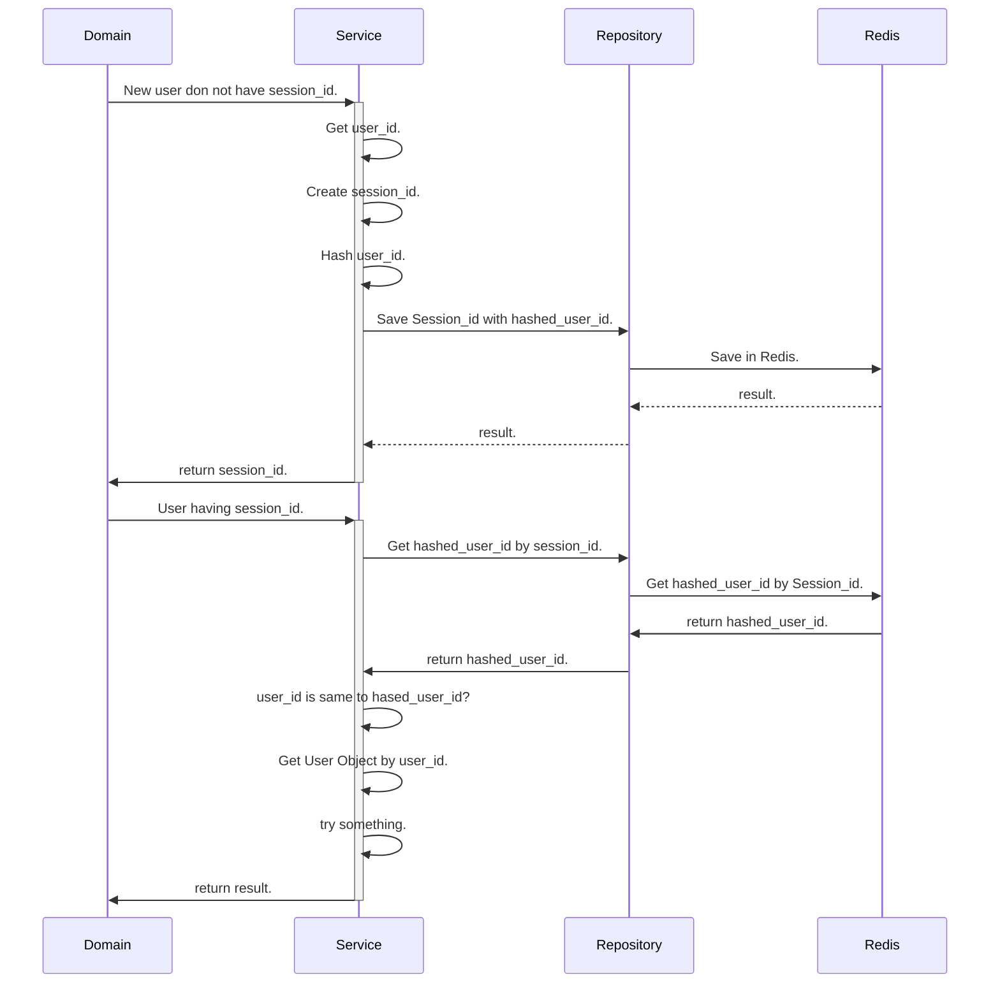

### SequenceDiagram with Redis

```mermaid
sequenceDiagram
    participant Domain
    participant Service
    participant Repository
    participant Redis
    Domain->>+Service: New user don not have session_id. 
    Service->>Service: Get user_id.
    Service->>Service: Create session_id.
    Service->>Service: Hash user_id.
    Service->>Repository: Save Session_id with hashed_user_id.
    Repository->>Redis: Save in Redis.
    Redis-->>Repository: result.
    Repository-->>Service: result.
    Service->>-Domain: return session_id.
    Domain->>+Service: User having session_id.
    Service->>Repository: Get hashed_user_id by session_id.
    Repository->>Redis: Get hashed_user_id by Session_id.
    Redis->>Repository: return hashed_user_id.
    Repository->>Service: return hashed_user_id.
    Service->>Service: user_id is same to hased_user_id?
    Service->>Service: Get User Object by user_id.
    Service->>Service: try something.
    Service->>-Domain: return result.
```